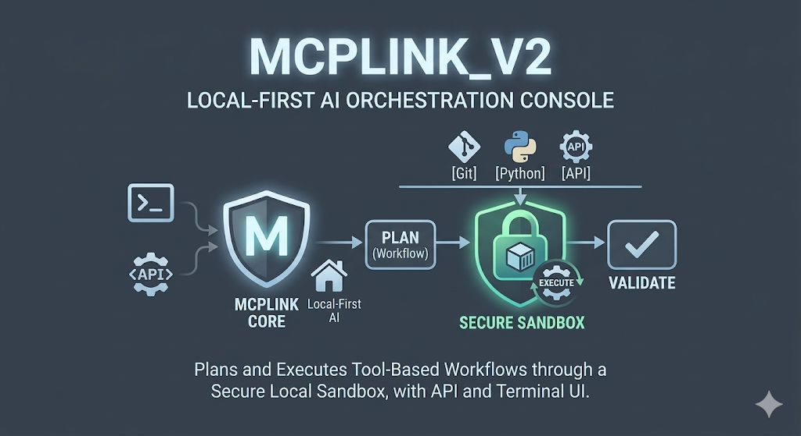
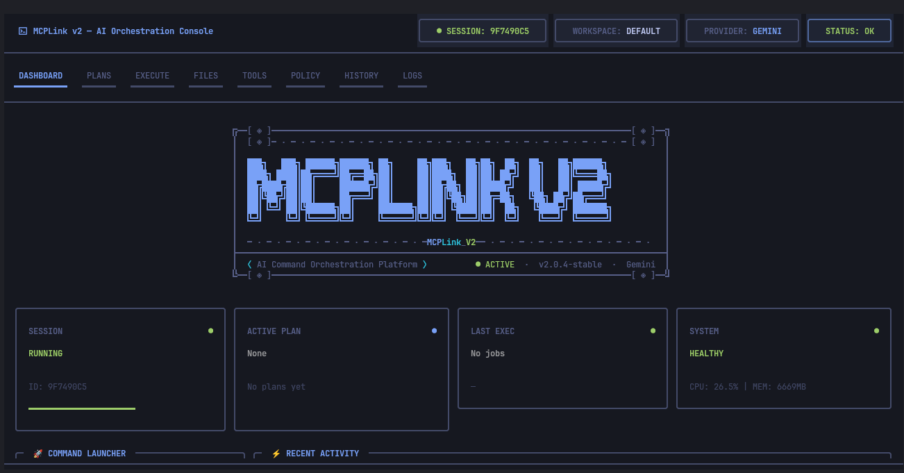
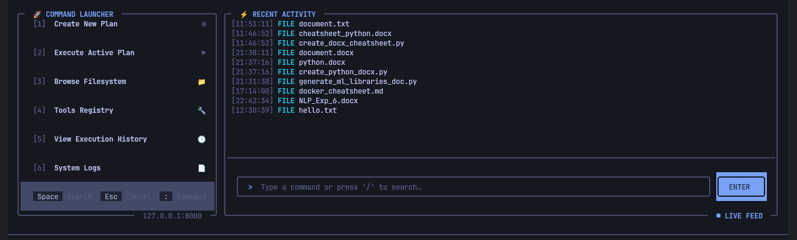
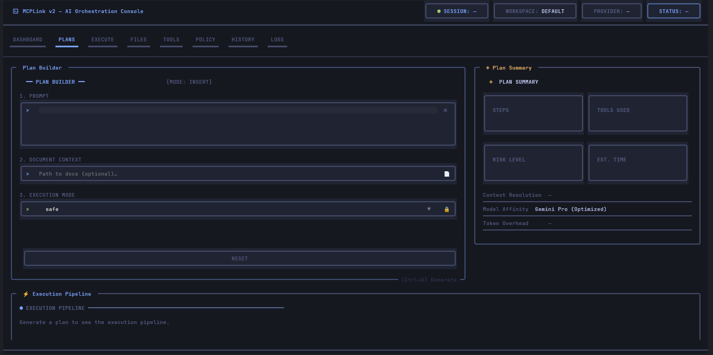
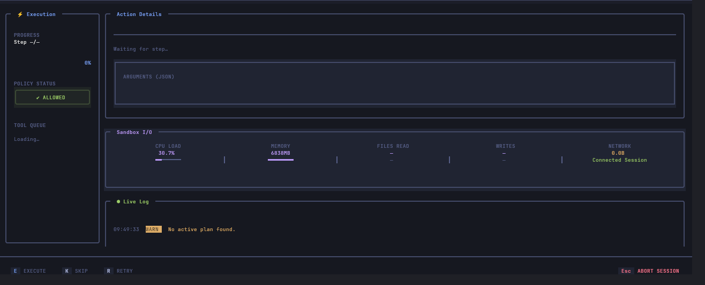
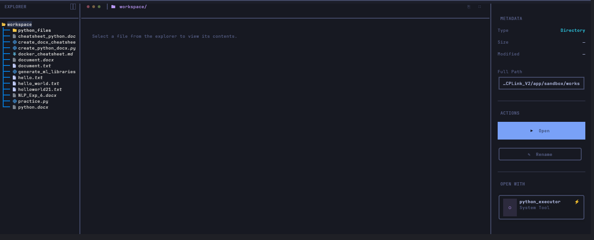
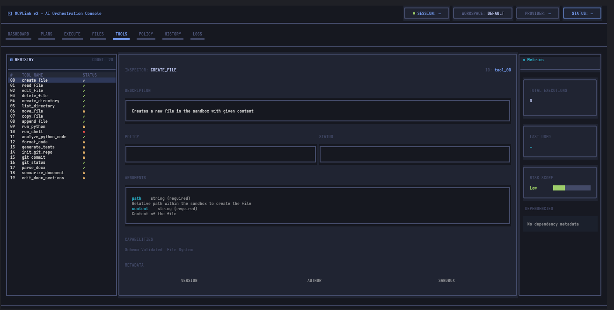
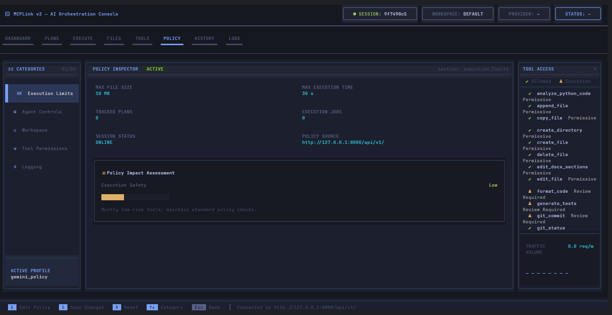
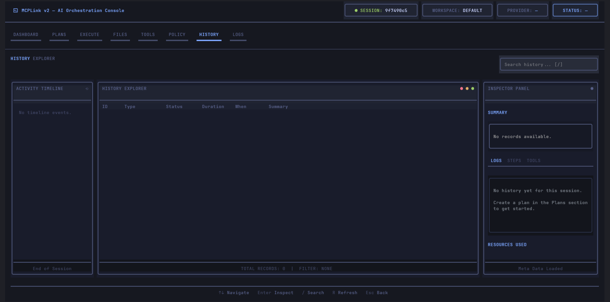

# MCPLink V2

A local-first AI orchestration console that plans and executes tool-based workflows through a secure sandbox, with both API and terminal UI experiences.


## Table of Contents

- [What Is MCPLink V2](#what-is-mcplink-v2)
- [Why This Project Exists](#why-this-project-exists)
- [Core Capabilities](#core-capabilities)
- [System Architecture](#system-architecture)
- [Repository Layout](#repository-layout)
- [Technology Stack](#technology-stack)
- [Setup and Installation](#setup-and-installation)
- [Configuration](#configuration)
- [Running the Project](#running-the-project)
- [How the Workflow Operates](#how-the-workflow-operates)
- [Backend API Overview](#backend-api-overview)
- [CLI Sections Explained](#cli-sections-explained)
- [Tools and Sandbox Model](#tools-and-sandbox-model)
- [Security, Policy, and Guardrails](#security-policy-and-guardrails)
- [Testing and Quality Checks](#testing-and-quality-checks)
- [Troubleshooting Guide](#troubleshooting-guide)
- [App Screenshots (7 Images)](#app-screenshots-7-images)
- [Roadmap](#roadmap)
- [Contributing](#contributing)
- [License](#license)

## What Is MCPLink V2

MCPLink V2 is an orchestration platform for AI-assisted development workflows. It combines a backend orchestration engine with a terminal-native UI, enabling users to:

- Start a session.
- Generate plans from prompts.
- Execute those plans step-by-step or in full mode.
- Observe behavior through logs, metrics, history, and policy insights.
- Work safely inside sandboxed filesystem boundaries.

The project is optimized for iterative, inspectable, and controllable agent workflows rather than opaque one-shot execution.

## Why This Project Exists

Most AI execution flows fail at one or more of the following:

- Lack of visibility into what is planned versus executed.
- Unclear safety boundaries around file and shell operations.
- Poor runtime controls (timeouts, policy, provider switching).
- Weak debugging experience when a step fails.

MCPLink V2 addresses these by design:

- Plan first, then execute.
- Keep all operations session-centric.
- Enforce guardrails through policy and sandbox checks.
- Provide clear UI sections for each operational stage.

## Core Capabilities

- Session lifecycle management from API and CLI.
- Planning engine that produces tool-oriented actionable steps.
- Execution modes:
	- Full: background job processing and status polling.
	- Step: controlled, operator-guided progression.
- Tool registry with typed schemas for argument validation.
- Runtime policy management for timeouts, file-size, logging, and provider controls.
- Dynamic terminal UI driven by live backend state.
- History and logs for post-run analysis.
- Hardened filesystem tools for common edge cases.

## System Architecture

High-level flow:

1. CLI sends user intent to backend.
2. Backend orchestrator generates a plan.
3. Plan is reviewed in UI.
4. Execution engine invokes registered tools.
5. Session state, history, and metrics update continuously.
6. UI screens render state from backend/session data.

Main architecture layers:

- API Layer: FastAPI routes for sessions, plans, execution, policy, tools, and files.
- Orchestration Layer: planning, execution, policy enforcement, context management.
- Tool Layer: schema-registered tools executed under constraints.
- Memory Layer: session store and run history.
- CLI Layer: Textual screens that visualize and control system state.

## Repository Layout

```text
MCPLink_V2/
├── app/
│   ├── api/            # HTTP routes
│   ├── core/           # Agent orchestration logic
│   ├── llm/            # Provider abstractions and schemas
│   ├── logs/           # Logging utilities
│   ├── memory/         # Session and history state
│   ├── sandbox/        # Path and policy limits
│   └── tools/          # Tool implementations + registry
├── cli/
│   ├── components/     # Reusable UI components
│   ├── screens/        # Dashboard, Plans, Execute, etc.
│   ├── api_client.py   # Backend client for UI
│   └── styles.tcss     # Global and screen-specific styling
├── tests/              # Unit/integration tests
├── file_operations.py  # Reference filesystem implementation (non-runtime)
├── requirements.txt
├── pyproject.toml
└── test_endpoints.sh
```

## Technology Stack

- Python 3.11+
- FastAPI for backend APIs
- Pydantic for strict request/response and tool argument schemas
- Textual for terminal UI
- httpx for async API communication
- pytest for testing

## Setup and Installation

### 1. Clone repository

```bash
git clone <your-repo-url>
cd MCPLink_V2
```

### 2. Create virtual environment

```bash
python -m venv .venv
source .venv/bin/activate
```

### 3. Install dependencies

```bash
pip install -r requirements.txt
```

### 4. Prepare environment variables

```bash
cp .env.example .env
```

Edit `.env` with provider credentials and runtime values.

## Configuration

Important configuration concerns:

- LLM provider selection (`gemini` / `openai`).
- Execution timeout limits.
- Max file size limits for sandbox file operations.
- Logging verbosity.
- Sandbox workspace base path.

All critical runtime controls should be consistent between `.env`, backend settings, and Policy screen behavior.

## Running the Project

### Start backend API

```bash
uvicorn app.main:app --reload
```

### Start CLI

In a second terminal:

```bash
python -m cli.main
```

### Optional endpoint smoke check

```bash
bash test_endpoints.sh
```

## How the Workflow Operates

Typical usage sequence:

1. Launch backend and CLI.
2. Create/attach session.
3. Write prompt in Plans.
4. Generate plan and inspect steps/risk.
5. Execute in full or step mode.
6. Watch action details, queue, and metrics in Execute.
7. Verify outputs in Files, History, and Logs.
8. Tune runtime constraints in Policy if needed.

This flow ensures planning transparency before side effects.

## Backend API Overview

Main route groups:

- Sessions
	- Create session
	- Get session state
	- Delete session
- Planning
	- Create plan from prompt
	- Retrieve specific plan
- Execution
	- Trigger execution (full/step)
	- Poll execution status
- Tools
	- List registered tool schemas
- Files
	- Upload file to sandbox
- Policy
	- Fetch runtime policy
	- Update runtime policy

Design principle: APIs expose state and control points cleanly enough for both automation and interactive operator workflows.

## CLI Sections Explained

- Dashboard
	- Session status, active plan signal, recent execution snapshot, system metrics, recent activity feed.
- Plans
	- Prompt-driven plan creation and pipeline preview.
- Execute
	- Step/full execution controls, queue view, argument and action detail, live logs.
- Files
	- Sandbox explorer, content preview, metadata, and file operations.
- Tools
	- Tool registry browser with policy/risk context and capability metadata.
- Policy
	- Runtime policy visibility/editing with category navigation and traffic metrics.
- History
	- Timeline and record-level inspection of plan/execution events.
- Logs
	- Tail-like runtime log stream for diagnostics.

## Tools and Sandbox Model

Tool behavior is registry-based:

- Each tool is registered with:
	- Name
	- Description
	- Pydantic args schema
	- Callable implementation
- The registry powers discoverability and validation for planning/execution.

Sandbox model:

- Paths are resolved and validated against sandbox base.
- Traversal outside sandbox is rejected.
- File operations are constrained by policy limits.
- Filesystem tooling includes practical safeguards:
	- Atomic writes where appropriate
	- Clear type/path checks
	- Better edge-case error handling

## Security, Policy, and Guardrails

Guardrail categories:

- Filesystem boundaries.
- Maximum file-size enforcement.
- Execution timeout controls.
- Runtime provider constraints.
- Policy-driven execution behavior.

Operational best practices:

- Use step mode for risky workflows.
- Keep policy strict in shared environments.
- Review history/logs after failures before retrying.
- Avoid broad shell execution unless explicitly needed.

## Testing and Quality Checks

Run test suite:

```bash
pytest -q
```

Useful compile checks:

```bash
python -m py_compile app/tools/filesystem.py
python -m py_compile cli/screens/*.py
```

Recommended quality routine before merge:

1. Run tests.
2. Run compile checks.
3. Run a manual CLI smoke pass for affected screens.
4. Validate policy and sandbox behavior for risky operations.

## Troubleshooting Guide

### Backend not reachable

- Ensure `uvicorn app.main:app --reload` is running.
- Verify base URL in CLI client matches backend host/port.

### Session shows OFFLINE

- Confirm backend process is active.
- Create a fresh session from CLI/API.

### Plan executes but no visible changes

- Inspect tool outputs in Execute and Logs.
- Confirm target path is inside sandbox workspace.
- Check policy limitations (size, timeout, restricted operations).

### File operation errors

- Verify path is relative/inside sandbox.
- Confirm file type and UTF-8 content assumptions.
- Check max file-size limits.

### UI looks stale

- Refresh relevant screen.
- Re-open screen to force state reload.
- Check backend endpoints directly for fresh state.

## App Screenshots (7 Images)

Paste your 7 images in this section.

Images are stored under `docs/images/`.

### 1. Dashboard
 

### 2. Plans


### 3. Execute


### 4. Files


### 5. Tools


### 6. Policy


### 7. History / Logs


## Roadmap

### Near-Term

- Expand core toolset with stronger built-in diagnostics.
- Increase test coverage for tool edge cases and failure recovery paths.
- Improve execution observability with richer per-step telemetry.
- Tighten policy UX for easier safe defaults and overrides.

### Mid-Term

- Add profile-based policy templates (development, strict, audit-heavy).
- Introduce deeper history analytics and searchable timelines.
- Improve plugin-like extension strategy for new tool families.
- Strengthen retry/recovery semantics for partial failures.

### Long-Term

- Optional web companion UI for remote operation.
- Multi-session orchestration and collaborative workflows.
- More advanced provider abstraction and model routing controls.
- Enhanced security posture with finer execution sandboxing.

## Contributing

Contributions are welcome.

Suggested process:

1. Fork and create a focused feature branch.
2. Keep changes scoped and coherent.
3. Add or update tests when behavior changes.
4. Run compile checks and a quick manual CLI pass.
5. Open a pull request with:
	- Problem statement
	- Implementation summary
	- Validation steps
	- UI screenshots/terminal captures for screen changes

Coding expectations:

- Preserve sandbox safety assumptions.
- Avoid breaking tool contracts unless coordinated.
- Prefer explicit errors over silent failures.
- Keep UI behavior backend-driven where possible.

## License

This project is licensed under the MIT License
